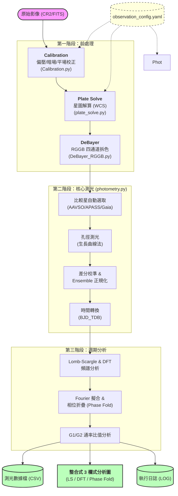

# 變星測光管線流程圖 (Pipeline Workflow)

這份文件展示了 **VarStar Pipeline v1.35** 的完整自動化處理流程。

---

## 流程步驟詳細說明

### 1. 校正 (Calibration)
*   **功能**：扣除感光元件的雜訊（Bias/Dark）並修正光學系統的不均勻性（Flat）。
*   **產出**：具備物理線性響應的 `calibrated/` FITS 檔案。

### 2. 星圖解算 (Plate Solve)
*   **功能**：透過 ASTAP 引擎對比星表，將像素座標 (X, Y) 轉換為天球座標 (RA, Dec)。
*   **產出**：帶有 WCS 標頭的 FITS 檔案。

### 3. 拆色 (DeBayer)
*   **功能**：將彩色 Bayer 矩陣分離為獨立的紅 (R)、綠 (G1, G2)、藍 (B) 通道。
*   **產出**：`split/` 子目錄下的各通道影像。

### 4. 核心測光與分析 (Photometry & Period Analysis)
*   **比較星**：自動查詢 AAVSO 或 Gaia 星表，篩選視野內穩定且亮度適中的比較星。
*   **生長曲線**：自動計算最佳孔徑大小，確保收集到最多的星光同時降低背景噪聲。
*   **整合分析**：計算 BJD_TDB 精確時間，並執行 LS 週期掃描與 Fourier 模型擬合。

### 5. 輸出產物 (v1.35)
*   **3 欄式圖表**：包含三種診斷視角（週期圖、振幅譜、相位圖），是分析變星最直覺的工具。
*   **G1/G2 比值**：用於驗證觀測資料的可靠性，排除大氣偏移干擾。

管線模組摘要 (中文版)
這套系統目前分為三個核心階段：

階段一：物理校正與準備

Calibration: 消除感光元件雜訊（Bias/Dark/Flat）。
Plate Solve: 賦予每張照片精確的天球座標 (WCS)。
DeBayer: 依據 Canon 6D2 的 RGGB 特性拆分通道。
階段二：精密測光 (v1.35)

比較星選取: 自動連線 AAVSO/APASS 星表找尋參考。
孔徑優化: 透過「生長曲線」自動計算每一顆星的最佳採測範圍。
差分修正: 利用周邊星場穩定光度變化。
階段三：產出與自動化

整合 3 欄圖: 也是您目前正在處理的獵戶座任務所產出的精美報告圖。
批次邏輯: 您現在執行中的 --date 驅動模式，確保目標自動銜接。

有做，而且是**逐星逐通道轉換**。整理如下：

---

### 各通道比較星星等轉換（Gaia DR3 來源）

|通道|目標波段|轉換公式|參考|
|---|---|---|---|
|G1、G2|V|`V = G + 0.02704 − 0.01424c + 0.2156c² − 0.01426c³`|Riello et al. 2021|
|R|Rc|`Rc = G − (0.02275 + 0.3961c − 0.1243c² − 0.01396c³ + 0.003775c⁴)`|Riello et al. 2021|
|B|B|`B = G + 0.0939 + 0.6758c + 0.0743c²`|使用者指定，限 BP-RP < 2|

其中 `c = BP − RP`（Gaia 色指數），每顆比較星獨立計算，並傳播誤差。

---

### 注意事項

1. **R 通道是近似**：改機後帶通延伸至近紅外，Rc 僅為近似，嚴格的色彩轉換係數需要 Landolt 標準星另行標定（CLAUDE.md 已記載為已知限制）
    
2. **APASS 來源的比較星**：直接用 V 和 Rc 欄位，不需轉換；只有 Gaia 來源才套上述公式
    
3. **轉換誤差**：已加入 `e_conv` 並傳進比較星的不確定度，參與 ZP 加權迴歸